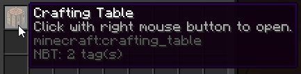

# FastCrafting
Spigot plugin that allows you to open workbench by clicking RMB on it in the inventory!

Spigot Resources: [FastCrafting](https://www.spigotmc.org/resources/fastcrafting.81283/)  
Curseforge: *(coming soon)*

### Using bStats!
Since version 1.1.0, plugin uses bStats to provide statistics. If you want to disable it, change `enabled` to `true` in its config file (`server directory/plugins/bStats/config.yml`).
